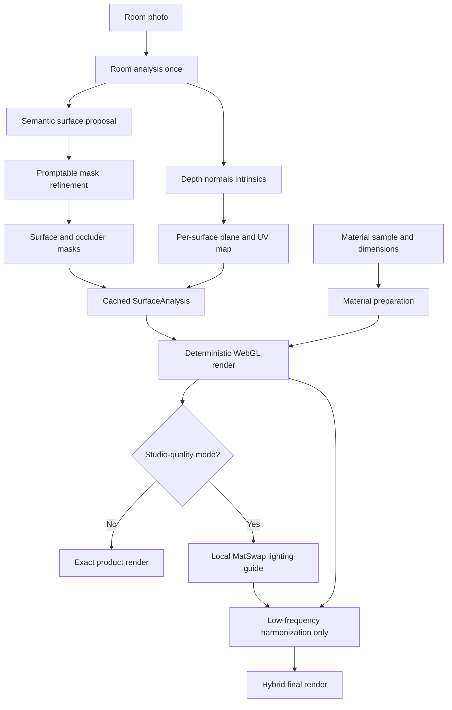

# Material Visualizer — Market-Ready, API-Free Rendering Plan

**Prepared:** 24 September 2026  
**Scope:** React/Vite studio + Node/Express/Prisma backend described in the supplied `CLAUDE.md`, `PROJECT.md`, and `SKILLS.md`  
**Goal:** Produce believable, product-faithful material visualization without a paid third-party image API or per-render token usage.

## Executive decision

Do **not** replace the existing renderer with one large generative model and expect error-free results. For a commercial material visualizer, the material's color, grain, repeat, dimensions, joints, and direction must remain faithful to the vendor's product. A generic image generator can make an attractive picture while silently changing those facts.

Build a **hybrid rendering engine**:

1. **Local computer vision analyzes a room once**: precise surface mask, foreground occluders, camera geometry, depth, normals, and planar coordinates.
2. **A deterministic WebGL material renderer performs every material swap**: correct perspective, physical scale, direction, joints, color space, shadows, and highlights.
3. **An optional self-hosted MatSwap pass contributes only low-frequency lighting harmonization**. It must never be allowed to replace the material's high-frequency grain or redraw objects.
4. **A confidence gate asks for one quick correction when automation is uncertain**. “Error-free” is not realistic for arbitrary single photographs; a market-ready system detects uncertainty instead of publishing a visibly wrong render.

This provides no external API dependency, no per-token charge, deterministic repeatable output, and a credible path to Gemini-like realism.

---

## What is wrong with the supplied output

The second image is recognizable as the original room, but the wall reads as an orange texture overlay rather than installed timber. The main visible faults are:

| Fault | Visible effect | Likely current cause | Required fix |
|---|---|---|---|
| Wrong color pipeline | Dark brown sample becomes bright orange | `overlay` / `soft-light` plus a tone wash in sRGB | Render in linear RGB; use the material albedo as the base color and multiply only recovered illumination |
| Weak physical scale | Grain and panels feel oversized/arbitrary | A fixed `swatchReferenceMm` or thumbnail-derived scale | Store actual product width/height and calibrate the surface with one real measurement |
| Flat pasted appearance | Surface has texture but little material response | Canvas2D blend modes, no robust normals/roughness | WebGL shader using normal, roughness, and retained scene illumination |
| Repeating “sheet” look | Similar vertical strips repeat across the wall | Simple periodic tiling/mirroring | Seamless texture preparation plus randomized, product-valid panel layouts |
| Geometry ambiguity | Different wall planes can share one projection | Label/keyword or four-corner approximation applied too broadly | Split coplanar regions and fit a 3D plane per region using geometry estimates |
| Occlusion and edge risk | Texture can touch or bleed over objects/moulding | Semantic mask alone and broad feathering | Promptable mask refinement, explicit occluder mask, and edge-aware compositing |
| Inconsistent app paths | Some scenes can be accurate while others use fallback logic | `maskUrl`/`plane` path exists for hotspots, while other paths still reach `synthesizeStudioRender()` | One `SurfaceAnalysis` contract and one renderer for all studio/storefront routes |

### Important documentation mismatch

The supplied files describe two generations of the renderer at once:

- `CLAUDE.md` documents `renderLayers()` with a saved mask and plane for showroom hotspots.
- `PROJECT.md` still says hotspot labels are matched against floor/wall keyword heuristics.
- The main studio's documented default remains `synthesizeStudioRender()` in `services/geminiService.ts`.

That split is the first item to remove. No production render should silently fall back to a label-based whole-wall overlay.

---

## Target architecture



The expensive models run only when a room is uploaded or edited. Switching among 100 materials should reuse cached analysis and take milliseconds, not invoke AI 100 times.

---

## Recommended local models

### Production recommendation

| Job | Browser/private mode | Self-hosted quality mode | Why |
|---|---|---|---|
| Coarse semantic labels | Keep SegFormer-B2 ADE20K | SegFormer-B2 or SAM 3.1 text proposal | Identifies wall, floor, ceiling, cabinetry, door, window, furniture |
| Precise interactive mask | SAM 2.1 Hiera Tiny/Small, ONNX/WebGPU | SAM 3.1 or SAM 2.1 Large | Positive/negative clicks and mask prompts give far cleaner edges than a semantic class map alone |
| Geometry, depth, normals, camera | MoGe-2 ViT-S Normal (35M), ONNX | MoGe-3 ViT-L (370M) | One model supplies point map, metric depth, normal map, intrinsics/FOV, and validity mask |
| Exact material application | Custom WebGL2 shader | Same WebGL2 shader | Fast, deterministic, physically scaled, and faithful to the actual product |
| Optional realism | None or original-image illumination recovery | MatSwap, cached per accepted render | Purpose-built, mask + material input, light/geometry-aware material transfer |

### Why these choices

- **SAM 2.1 Tiny/Small** is a practical, permissively licensed promptable segmenter. It is much lighter than SAM 3.1 and can be exported for local inference.
- **SAM 3.1** is the strongest automatic text-prompt option in this set, but it is an 848M-parameter CUDA model and its checkpoint download requires initial Hugging Face access. It is suitable for a controlled GPU worker, not every customer's browser.
- **MoGe-2/3** is a better fit than depth alone because it directly returns geometry, depth, camera intrinsics, and optionally normals. MoGe-3 was released in August 2026; use it on the quality worker after benchmarking. Use MoGe-2 ViT-S Normal in the lighter path.
- **MatSwap** is much closer to this use case than a generic inpainting model. It takes the scene, binary mask, and material sample, and estimates extra scene descriptors such as normals and irradiance. It should remain an optional harmonizer because diffusion can alter exact product details.
- **MaterialFusion** is not recommended for production here: its documented reference setup uses a 40 GB NVIDIA V100, making it unnecessarily expensive for this SaaS.

### Meaning of “no API or token”

- Host model files under the application's own origin and download/cache them once.
- In Transformers.js set `env.allowRemoteModels = false`, configure `env.localModelPath`, and serve the ONNX/WASM assets yourself.
- In quality mode, Node calls a private Python inference worker on your own machine or GPU server. There is no call to Gemini, OpenAI, or another metered image API.
- Compute is not literally free: browser mode uses the customer's CPU/GPU; self-hosted mode uses your GPU. The design minimizes cost by analyzing each room once and caching the result.

---

## The rendering algorithm

### 1. Analyze and validate the input image

Before any model runs:

- Respect EXIF rotation and convert the image to sRGB.
- Retain a full-resolution source; use a downscaled analysis copy with its exact scale transform recorded.
- Reject or warn for images below 1280 px on the long edge, extreme JPEG damage, severe motion blur, or ultra-wide/fisheye distortion.
- Hash the normalized image. Reuse analysis when the same room is uploaded again.

### 2. Generate a surface proposal

SegFormer remains useful as a **class proposer**, not as the final mask.

1. Produce semantic masks for wall, floor, ceiling, door, window, cabinet, and major furniture/foreground objects.
2. Split disconnected components. Never treat all pixels labelled “wall” as one physical plane.
3. Seed SAM with:
   - positive points well inside the proposed surface;
   - negative points on windows, artwork, mirrors, plants, lamps, furniture, doors, skirting, cornices, and adjacent walls;
   - the coarse class mask or its bounding box.
4. Score each candidate mask using:
   - semantic agreement;
   - alignment with image edges;
   - consistency of depth and surface normals;
   - connectedness and reasonable area.
5. If confidence is below the threshold, show the mask overlay and request one positive/negative click or brush correction.

Do not render when there is no accepted pixel mask. A label such as `Backwall of bed` is metadata, not geometry.

### 3. Separate the target from occluders

Store two concepts, not one:

- `surfaceMask`: all visible pixels belonging to the selected plane.
- `occluderMask`: foreground pixels that must always be restored above the material, including furniture, plants, frames, lamps, mirrors, curtains, switches, and moulding.

Refine both at the original resolution with guided upsampling or an edge-aware filter. Keep a hard interior mask and a narrow 1–2 px antialiased boundary. Large feathering creates halos.

### 4. Recover geometry and construct UV coordinates

Run MoGe once for the room and use the 3D point map inside the accepted surface:

1. Exclude invalid points, depth discontinuities, and occluders.
2. Fit one or more planes with RANSAC.
3. Reject a plane when residual error or normal variance is too high.
4. Build an orthonormal surface basis. Align vertical with estimated gravity and horizontal with its cross product.
5. Project every target pixel's 3D point into that basis to obtain stable `(u, v)` coordinates.
6. Calibrate scale from one user-known dimension when exact size matters. Suggested options: wall width, wall height, door height, or a two-point ruler. Model-estimated metric scale alone should not be presented as survey-grade measurement.
7. When plane fitting fails, fall back to the current four-corner editor—not to keyword rendering.

This solves perspective naturally. A homography remains acceptable for a flat, manually confirmed quadrilateral; a fitted 3D plane is more robust for cluttered photographs.

### 5. Prepare a real material asset

Do not treat a catalog thumbnail as a production texture without validation. At import, create a `MaterialAsset` with:

- front-facing albedo image;
- real width and height represented by that image;
- repeat mode: seamless, single slab/sheet, staggered tile, random plank, bookmatch, or no repeat;
- grain direction and allowed rotation;
- joint/gap width and color;
- roughness, metallic, normal-strength, and sheen values;
- optional vendor-provided albedo, normal, roughness, height, and displacement maps;
- source color profile and a neutral-color reference if available.

Preprocessing should:

1. Detect and rectify the photographed sample's four corners.
2. Remove background and border pixels.
3. Apply white balance and remove broad lighting gradients without destroying grain.
4. Find a valid repeat or build a seamless repeat with overlap/graph-cut or patch quilting.
5. Create mip levels.
6. Generate conservative normal/roughness approximations only when vendor maps are unavailable.

For a physical sheet product, never invent a random small repeat. Render whole sheets at their real dimensions and draw their actual joints.

### 6. Replace Canvas2D blending with a linear-light WebGL renderer

The base render must be product-faithful:

1. Convert source room and texture from sRGB to linear RGB.
2. Sample the material in physically scaled UV coordinates using mipmapping and anisotropic filtering.
3. Recover low-frequency illumination and light color from the original surface while suppressing its old paint/material color.
4. Multiply the new albedo by that illumination; do not use CSS/Canvas `overlay`, `color`, or `soft-light` as the main color model.
5. Add a restrained specular term driven by surface normal, material normal, roughness, and estimated dominant light direction.
6. Draw panels, tile grout, plank offsets, or slab seams in the same UV space so they follow perspective.
7. Composite through the accepted surface alpha.
8. Restore the original occluder pixels exactly above it.
9. Convert back to sRGB and preserve the original image byte-for-byte outside a 1–2 px mask boundary.

Conceptually:

```text
roomLinear   = srgbToLinear(room)
albedo       = sampleMaterial(physicalUV, mipLevel)
illumination = recoverLowFrequencyLight(roomLinear, surfaceMask)
detailShadow = recoverContactShadow(roomLinear, surfaceMask)
specular     = evaluateSpecular(sceneNormal, materialNormal, roughness, lights)

surfaceRGB = albedo * illumination * detailShadow + specular
result      = composite(roomLinear, surfaceRGB, surfaceAlpha)
result      = restoreOriginalOccluders(result, roomLinear, occluderMask)
output      = linearToSrgb(result)
```

### 7. Optional MatSwap hybrid—not unrestricted generation

For “Studio Quality”:

1. Produce the deterministic exact render `R_exact`.
2. Run MatSwap locally with the original image, accepted mask, material sample, fixed seed, and scale.
3. Call the result `R_ai`.
4. Extract only a low-frequency lighting correction inside the mask:

```text
H = bilateralLowPass(log(R_ai + eps) - log(R_exact + eps))
H = clamp(H, -0.25, +0.25)
R_final = exp(log(R_exact + eps) + strength * H)
```

5. Restore the exact high-frequency material detail from `R_exact` and restore every outside-mask pixel from the original.

If MatSwap changes geometry, product hue, repeat, or edge position beyond tolerance, automatically discard it and return `R_exact`.

---

## Unify the application around one data contract

Introduce a first-class `SurfaceAnalysis` instead of treating a hotspot label as a surface:

```ts
type SurfaceKind =
  | 'wall' | 'floor' | 'ceiling' | 'cabinet'
  | 'countertop' | 'door' | 'furniture' | 'custom';

interface SurfaceAnalysis {
  id: string;
  imageId: string;
  kind: SurfaceKind;
  label: string;
  maskUrl: string;
  occluderMaskUrl?: string;
  analysisVersion: string;
  modelVersions: Record<string, string>;
  confidence: number;
  needsReview: boolean;
  plane: {
    normal: [number, number, number];
    origin: [number, number, number];
    axisU: [number, number, number];
    axisV: [number, number, number];
    homographyFallback?: number[];
    residual: number;
  };
  calibration?: {
    p1: [number, number];
    p2: [number, number];
    distanceMm: number;
  };
  lightingMapUrl?: string;
}

interface MaterialPhysicalProfile {
  realWidthMm: number;
  realHeightMm: number;
  repeatMode: 'seamless' | 'sheet' | 'tile' | 'plank' | 'bookmatch' | 'none';
  orientationDeg: 0 | 90 | 180 | 270;
  jointWidthMm?: number;
  jointColor?: string;
  roughness: number;
  metallic: number;
  normalStrength: number;
  albedoUrl: string;
  normalUrl?: string;
  roughnessUrl?: string;
  heightUrl?: string;
}
```

Every route must call one function:

```ts
renderMaterial(roomImage, surfaceAnalysis, materialProfile, renderSettings)
```

Use it in:

- custom room upload;
- curated room;
- signed-in studio;
- showcase editor preview;
- public storefront;
- multi-surface/layer render.

Delete or visibly label the old keyword compositor as `legacyDemoRender`; never invoke it for a customer-facing result.

---

## Suggested repository changes

```text
services/
  roomAnalysis.ts              # Orchestration and cache key
  semanticSegmentation.ts      # SegFormer proposal
  promptSegmentation.ts        # SAM refinement adapter
  geometryEstimation.ts        # MoGe adapter
  surfacePlaneFit.ts           # RANSAC, components, confidence
  materialPreprocess.ts        # Rectification, repeat, maps
  lightingRecovery.ts          # Linear-light illumination maps
  qualityGate.ts               # Reject/ask-for-review rules
  renderer/
    materialRenderer.ts        # One public render API
    webglContext.ts
    material.vert.glsl
    material.frag.glsl
components/
  SurfaceReviewModal.tsx       # Mask overlay, +/- clicks, brush
  SurfacePlaneEditor.tsx       # Auto result plus four-corner fallback
  MaterialScaleEditor.tsx      # Real dimensions, direction, joints
workers/
  analysis.worker.ts           # Browser models and preprocessing
vision-service/                # Optional self-hosted quality worker
  app.py
  models.py
  pipelines/analyze_room.py
  pipelines/matswap_harmonize.py
  tests/
```

Database additions should store room-analysis version, model versions, masks, geometry, confidence, and material physical metadata. Store large maps in object storage; keep compact JSON and URLs in MySQL.

---

## User experience that prevents bad results

Keep the flow simple:

1. **Upload room** — analysis starts automatically.
2. **Click a surface** — closest high-confidence surface is selected.
3. **Confirm only when needed** — mask overlay appears only below the confidence threshold; the user can add/erase or click +/−.
4. **Choose material** — render immediately from cached analysis.
5. **Adjust size/direction** — one slider/ruler plus rotate control.

Always offer three debug overlays to staff/admin users:

- mask + occluders;
- plane/UV grid;
- recovered lighting.

Those overlays will identify whether a failure belongs to segmentation, geometry, material preparation, or shading in seconds.

Replace the current `AI Enhance` concept with two understandable modes:

- **Exact Preview** — deterministic and product-faithful.
- **Studio Lighting** — optional local harmonization, clearly marked as a visual approximation.

---

## Confidence and automatic fallback rules

Do not promise “95%” because a model emitted a score. Compute a composite production confidence:

```text
confidence =
  0.30 * maskModelScore +
  0.20 * semanticAgreement +
  0.20 * boundaryEdgeAgreement +
  0.20 * planeInlierRatio +
  0.10 * normalConsistency
```

Suggested policy after calibration on your own validation set:

- `>= 0.85`: render automatically;
- `0.65–0.85`: render preview but request confirmation;
- `< 0.65`: require mask/plane correction before final render.

The numeric thresholds must be calibrated with real vendor/customer images; they are starting values, not universal truth.

---

## Acceptance tests for a market-ready release

### Non-negotiable automated checks

1. **Outside-mask preservation:** pixels more than 2 px outside the accepted mask match the original exactly.
2. **Occluder preservation:** foreground-object pixels match the original with SSIM >= 0.995.
3. **Perspective:** grid/plank/tile lines remain straight on a planar surface and converge consistently with the estimated camera.
4. **Physical scale:** after one known-distance calibration, joint spacing and panel size are within 5% of the configured dimensions.
5. **Color fidelity:** on a neutral, evenly lit test surface, material color stays within an agreed CIEDE2000 tolerance; begin with Delta E <= 6 and tighten with calibrated capture.
6. **No seam discontinuity:** seamless materials do not show repeat-edge jumps above an image-gradient threshold.
7. **Determinism:** same inputs, engine version, and settings generate the same exact render hash.
8. **Fail safely:** invalid mask, geometry, texture, or CORS input returns a clear correction step, never the legacy overlay.

### Validation set

Create at least 60 owned/licensed room photographs:

- 20 walls;
- 15 floors;
- 10 cabinet/door surfaces;
- 10 countertops;
- 5 difficult scenes with plants, mirrors, curtains, strong shadows, and oblique angles.

For each scene retain an approved mask, plane, scale reference, and three reference materials. Track failures by stage rather than only asking whether the final image “looks good.”

### Engineering tests

- Vitest: color conversion, homography, plane UV math, repeat layout, physical units, and mask compositing.
- Playwright: upload → select surface → correct mask → choose material → compare/download.
- Pytest: model adapters, deterministic seeds, cache keys, and response schemas.
- Golden-image tests: allow small GPU-specific tolerance inside the surface; require exact preservation outside it.

---

## Delivery sequence

### Phase 0 — Stop the visibly wrong output

- Route every render through a real accepted mask.
- Disable the label-only customer-facing fallback.
- Remove `overlay`/`soft-light` as the primary material color operation.
- Add real width, height, direction, and repeat mode to each material.
- Add mask and UV-grid preview tools.

**Expected impact:** the existing output becomes materially more believable before adding a new large model.

### Phase 1 — Geometry-aware exact engine

- Add MoGe-2 ViT-S Normal locally.
- Fit per-component planes and generate surface UVs.
- Move rendering from Canvas2D to WebGL2.
- Add mipmapping, anisotropic sampling, physical seams, and linear-light shading.

### Phase 2 — Robust masks

- Keep SegFormer as automatic class proposal.
- Add SAM 2.1 prompt refinement and positive/negative clicks.
- Add explicit occluder masks and full-resolution edge refinement.
- Cache analysis per image/version.

### Phase 3 — Self-hosted studio quality

- Benchmark SAM 3.1 + MoGe-3 against the lighter pipeline.
- Add MatSwap behind an internal feature flag.
- Use the low-frequency harmonization rule and reject product drift automatically.
- Record model/engine versions with every render.

### Phase 4 — Productization

- Build the validation set and quality dashboard.
- Add cancellation, progress reporting, GPU-worker queue, timeouts, and CPU/browser fallback.
- Add privacy/retention controls for customer photos.
- Update `CLAUDE.md` and `PROJECT.md` so they describe one canonical renderer and one material-catalog policy.

---

## What not to do

- Do not call a generic diffusion model for every swatch click.
- Do not let the model redraw furniture, openings, or architectural structure.
- Do not use a catalog thumbnail's pixel dimensions as real material dimensions.
- Do not use `soft-light`, `overlay`, or a fixed orange/brown tone as the main lighting method.
- Do not merge disconnected wall regions into one plane.
- Do not report a model confidence value as real-world accuracy without calibration.
- Do not market model-estimated dimensions as exact measurements.
- Do not keep separate rendering implementations for the main studio and storefront.

---

## Claude Code implementation brief

Use this as the next repository task:

> Replace the Material Visualizer's label-based Canvas2D production path with one canonical `SurfaceAnalysis`-based renderer shared by App, showcase editor, and storefront. First add debug overlays and enforce an accepted mask; never silently call the legacy heuristic when mask or geometry is missing. Add linear-sRGB helpers and an exact Canvas/WebGL baseline that uses the material albedo directly, preserves low-frequency scene illumination, restores occluders, and leaves pixels outside the mask unchanged. Add material physical dimensions, repeat mode, direction, roughness, and joint metadata. Then add MoGe geometry behind an adapter and per-surface plane/UV fitting, followed by SAM-based mask refinement behind another adapter. Preserve the existing Gemini option only as a temporary comparison feature, not a dependency. Add unit, integration, and golden-image tests for outside-mask preservation, scale, perspective, deterministic output, and safe failure. Make changes in small verified stages and update `CLAUDE.md`/`PROJECT.md` after the implementation matches reality.

---

## Primary references checked

- Meta SAM 3 / 3.1: <https://github.com/facebookresearch/sam3>
- Meta SAM 2.1: <https://github.com/facebookresearch/sam2>
- Microsoft MoGe-2 / MoGe-3: <https://github.com/microsoft/MoGe>
- Hugging Face Transformers.js local/WebGPU runtime: <https://github.com/huggingface/transformers.js>
- MatSwap: <https://github.com/astra-vision/MatSwap>
- MaterialFusion: <https://github.com/ControlGenAI/MaterialFusion>

## Bottom line

The current result is not poor because a paid Gemini call is missing. It is poor because the product is still mixing a legacy 2D compositor with an incomplete surface-analysis path. Fix masks, geometry, physical texture scale, linear-light shading, and one shared render contract first. Then use a task-specific local model such as MatSwap only as a controlled lighting assistant. That combination is more accurate, cheaper to operate, and more defensible for a commercial material catalog than unrestricted generative rendering.
